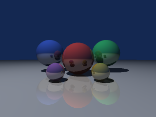

# A raytracer whose scene comes from Elixir



A recursive sphere raytracer in Bend, called from Elixir as a port. The
float kernel is adapted from Bend's own
[runtime benchmark](https://github.com/bendlang/bend/blob/7561656155a4285c1e4ccfcb3505ab59524de973/bench/runtime/raytrace/main.bend)
(Apache-2.0); the scene, the colour, the tiling and all the scheduling
are this demo's.

This is the first demo whose **arguments are user datatypes**. The whole
scene description crosses the boundary:

```
type Vec is Data:
  Vec{x: F32, y: F32, z: F32}

type Sphere is Data:
  Sphere{center: Vec, radius: F32, color: Vec, mirror: F32}

type Scene is Data:
  Scene{spheres: List<&2, Sphere>, light: Vec, eye: Vec, sky: Vec}
```

so `RaytracePort.scene(spheres, light, eye, sky)` in Elixir arrives in
Bend as a `Scene`, and the pixels come back as the prelude's `B.Bytes`,
three bytes per pixel, row-major inside the requested tile. Nothing about
the scene is baked into the Bend file.

What the demo is meant to show:

- **datatypes as the interface**: a scene, not a pile of packed floats
- **Bytes out**: 0.88 MiB of pixels in one buffer, not a list cell per byte
- **parallel tiles**: `render_tiles/4` forks the tiles, and every tile
  forks its rows as a balanced tree, so one call uses every core
- **Elixir owns scheduling and cancellation**: Elixir cuts the tiles,
  sizes the batches, streams the rows out as they arrive, and bounds the
  call with `:timeout` — past the deadline the call raises
  `Bendler.Error` with reason `:timeout`, the port owner stops and the
  supervisor puts a fresh one back.

Per pixel: 2x2 supersampling, a point light with a shadow ray, five
levels of mirror bounce in accumulator form (`acc += w * (1 - kr) *
colour * lum`, `w *= kr`), the sky colour on a miss, then clamp and
truncate to bytes.

## Run

```sh
mix test demos/raytrace/test
MIX_ENV=test mix run demos/raytrace/bench.exs
```

```elixir
alias Bendler.Demos.RaytracePort
{:ok, sup} = Supervisor.start_link([{RaytracePort, threads: 12}], strategy: :one_for_one)

scene =
  RaytracePort.scene(
    [RaytracePort.sphere(RaytracePort.vec(0, 0, 5), 1, RaytracePort.vec(0.9, 0.25, 0.2), 0.35),
     RaytracePort.sphere(RaytracePort.vec(0, -10001, 5), 10000, RaytracePort.vec(0.75, 0.75, 0.75), 0.3)],
    RaytracePort.vec(-3, 8, 1),   # the point light
    RaytracePort.vec(0, 0, 0),    # the eye, looking down +z
    RaytracePort.vec(0.08, 0.16, 0.32)
  )

{640, 480, rgb} = RaytracePort.render(scene, 640, 480, tile: 64, batch: 4)
RaytracePort.save_png("/tmp/scene.png", scene, 320, 240)

# progressively, as the tiles arrive
scene |> RaytracePort.stream(640, 480) |> Enum.each(fn {tile, bytes} -> show(tile, bytes) end)
```

`render/4` takes `:tile` (edge in pixels, default 64), `:batch` (tiles per
Bend call, default 4) and `:on_tile` (a callback per tile). `save_png/5`
writes the result through `lib/png.ex`, forty lines of `:zlib` over
truecolour scanlines. `render_checked/7` answers a `Result`, so a tile
outside the image comes back as `{:error, "tile out of the image, or
empty"}` rather than an exception.

## Numbers

Apple M2 Pro, 12 online schedulers, macOS arm64, Elixir 1.21.0-dev,
OTP 28, Bend 2.0.20. Five warm samples after one warm-up, median wall
time, nothing else running. Every Port row includes encoding the scene,
the hand-off, the render and decoding the pixels; the tiled rows also
include Elixir reassembling the image.

Default scene (six spheres), 640x480, 0.88 MiB of pixels out:

| | 1 thread | 4 threads | 12 threads |
|---|---:|---:|---:|
| whole image in one call | 162.6 ms | 56.5 ms | 40.2 ms |
| tiled, 64 px, 4 tiles per call | 157.9 ms | 66.8 ms | 51.5 ms |

Same renderer, 160x120, 12 threads:

| | median |
|---|---:|
| Bend port | 3.6 ms |
| Elixir reference (doubles) | 127.2 ms |

so about **35x** at the same image, and 640x480 in Elixir would be around
two seconds against Bend's 40 ms.

Transfer and hand-off:

| | median |
|---|---:|
| `render_tile` of 1x1 (hand-off, scene encode, three bytes back) | 0.027 ms |
| 640x480 with **no spheres at all** | 24.4 ms |
| 640x480, six spheres | 40.2 ms |

The second row is the honest one. With an empty scene the four rays per
pixel still fly and miss, the 921,600-byte buffer is still built and
still crosses — and that costs 24 ms of the 40. **About 60% of a
640x480 render is pixel plumbing, not ray tracing**: building the byte
list in Bend, packing it into the `Bytes` array, and moving 0.88 MiB
through the port. Adding more spheres would shift the ratio; this scene
is too cheap per pixel for the buffer cost to disappear.

Two things Elixir wins or ties:

- **Tiling never beats the single call.** One `render_tile` of the whole
  image is 20–30% faster than the same image as 64-pixel tiles at every
  thread count. Tiles buy progressive delivery and a shorter deadline per
  call, not speed.
- **Batch size matters more than tile size, and bigger is worse.** With
  12 threads, 64-pixel tiles at 640x480: batch 1 → 81 ms, batch 2 →
  53 ms, batch 4 → 56 ms, batch 8 → 90 ms, batch 16 → 125 ms. Handing
  Bend many coarse tiles at once makes it *slower*, which is why the
  default is 4. Choose the batch before the thread count.

Thread scaling is 4.0x from 1 to 12 threads, well short of the
Mandelbrot demo's 7.5x, and the paragraph above says why: the serial
tail (the byte list, the pack, the transfer) does not shrink with more
workers.

## F32 against doubles

`RaytraceReference` is the same algorithm in Elixir doubles, step for
step and in the same association order. On the default scene at 96x72,
**33 of 20,736 channels differ (0.16%), mean absolute difference 0.0029,
worst 6 of 255**. The test asserts a max of 24, a mean under 0.05 and
under 1% of channels differing, and prints the actual figures.

The differences are not spread evenly: they sit on silhouettes, on the
shadow boundary and where a channel lands exactly on a quantisation
step, which is where single and double precision disagree about which
side of a comparison a value falls. This is the same finding as the
ThumbHash demo's, one algorithm louder: Bend 2 has no `F64`, so a port
that must match a double-precision reference bit for bit cannot.

The float code itself is verified exactly rather than approximately:
`upstream_checksum(rows, width)` keeps Bend's own fixed nine-sphere
scene verbatim, and the tests pin three of its checksums taken from runs
of the upstream file — `(6, 80)` is 402,971, `(3, 40)` is 19,281,
`(7, 123)` is 1,245,125. Those pass bit-exactly, so the F32 arithmetic,
the quadratic solve and the bounce algebra are right; only the
comparison against doubles is fuzzy.

## Limitations

- Spheres only: no planes, triangles or meshes, one point light, no
  refraction, no anti-aliasing beyond the fixed 2x2 supersample, bounce
  depth fixed at five levels in the Bend source.
- The camera is upstream's: at `eye`, looking down `+z`, with the film
  half-width scaled by `w / 2`. There is no field-of-view or orientation
  parameter; moving the eye moves the origin of every ray, nothing else.
- `render_tile/7` does not check its tile. A tile reaching past the image
  renders the pixels anyway, at coordinates outside it; use
  `render_checked/7` when the tile comes from outside your own code.
- The scene crosses on every call, so a 10,000-sphere scene would pay the
  datatype conversion (~1 µs per node) 20 times over a tiled render.
  Keep scenes small, or render in one call.
- `:timeout` stops the port owner; it does not kill the render. The
  worker exits when it next writes to the closed pipe, which is the
  `bendler: stdout write failed` line the deadline tests print. That is
  the library's documented cancellation limit, not this demo's.
- The PNG writer is 8-bit truecolour with filter 0 only. It is not a PNG
  library.

## What the port taught

- **A multi-line `def` signature is not exportable.** `Bendler.Sig`
  reads one line, so `render_tiles` and `render_checked` had to have
  their parameters and return type on a single (long) line before they
  appeared in the module. It is reported at debug level, which is easy to
  miss: `MIX_ENV=test mix compile` and read the
  `does not export ...: a signature bendler cannot read (multi-line?)`
  lines. Two of the ThumbHash demo's defs are in the same position.
- **The generated `@type` per datatype collides with your own.** The
  module gets `vec/0`, `sphere/0`, `scene/0` from the Bend `type`
  declarations, so writing those typespecs by hand is a compile error.
  Use the generated ones (they are what this module's `@spec`s refer to).
- **A tuple is `Type`-kinded, so it cannot live in a `List<&2, _>`.**
  The flattened sphere started as an eight-wide tuple and had to become
  `type Sph8 is Data` before the scene list could be reusable across
  forks. Flat `Data` records are the shape that works.
- **Flatten before the hot loop.** Carrying `Sphere{center: Vec, ...}`
  through the nearest-hit fold clones a three-node structure per sphere
  per ray. Converting the scene once to a flat eight-word record and
  carrying that is worth a large constant factor.
- **The prelude's `Bytes.from_list` walks the list three times** (a
  reusability copy, a length, a fill). The length here is known up front
  (`tw * th * 3`), so the demo packs the array itself in one pass: 640x480
  went from 57 ms to 40 ms on twelve threads. A `Bytes.from_list` that
  takes a known length would be a useful prelude addition.
