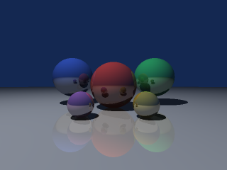

# A raytracer whose scene comes from Elixir


A recursive sphere raytracer in Bend, called from Elixir as a port. The
float kernel is adapted from Bend's own
[runtime benchmark](https://github.com/bendlang/bend/blob/7561656155a4285c1e4ccfcb3505ab59524de973/bench/runtime/raytrace/main.bend)
(Apache-2.0); the scene, the colour, the tiling and all the scheduling
are this demo's.

This is the first demo whose **arguments are user datatypes**. The whole
scene description crosses the boundary:

```
type Vec is Data:
  Vec{x: F32, y: F32, z: F32}

type Sphere is Data:
  Sphere{center: Vec, radius: F32, color: Vec, mirror: F32}

type Scene is Data:
  Scene{spheres: List<&2, Sphere>, light: Vec, eye: Vec, sky: Vec}
```

so `RaytracePort.scene(spheres, light, eye, sky)` in Elixir arrives in
Bend as a `Scene`, and the pixels come back as the prelude's `B.Bytes`,
three bytes per pixel, row-major inside the requested tile. Nothing about
the scene is baked into the Bend file.

What the demo is meant to show:

- **datatypes as the interface**: a scene, not a pile of packed floats
- **Bytes out**: 0.88 MiB of pixels in one buffer, not a list cell per byte
- **parallel tiles**: `render_tiles/4` forks the tiles, and every tile
  forks its rows as a balanced tree, so one call uses every core
- **events out of Bend**: `fly/5` renders a whole camera turn in one call
  and each frame arrives in Elixir as Bend finishes it, acknowledged one
  at a time, assembled into an animated PNG while the render still runs
- **Elixir owns scheduling and cancellation**: Elixir cuts the tiles,
  sizes the batches, streams the rows out as they arrive, and bounds the
  call with `:timeout` — past the deadline the call raises
  `Bendler.Error` with reason `:timeout`, the port owner stops and the
  supervisor puts a fresh one back.

Per pixel: 2x2 supersampling, a point light with a shadow ray, five
levels of mirror bounce in accumulator form (`acc += w * (1 - kr) *
colour * lum`, `w *= kr`), the sky colour on a miss, then clamp and
truncate to bytes.

## Run

```sh
mix test demos/raytrace/test
MIX_ENV=test mix run demos/raytrace/bench.exs
```

```elixir
alias Bendler.Demos.RaytracePort
{:ok, sup} = Supervisor.start_link([{RaytracePort, threads: 12}], strategy: :one_for_one)

scene =
  RaytracePort.scene(
    [RaytracePort.sphere(RaytracePort.vec(0, 0, 5), 1, RaytracePort.vec(0.9, 0.25, 0.2), 0.35),
     RaytracePort.sphere(RaytracePort.vec(0, -10001, 5), 10000, RaytracePort.vec(0.75, 0.75, 0.75), 0.3)],
    RaytracePort.vec(-3, 8, 1),   # the point light
    RaytracePort.vec(0, 0, 0),    # the eye, looking down +z
    RaytracePort.vec(0.08, 0.16, 0.32)
  )

{640, 480, rgb} = RaytracePort.render(scene, 640, 480, tile: 64, batch: 16)
RaytracePort.save_png("/tmp/scene.png", scene, 320, 240)

# progressively, as the tiles arrive
scene |> RaytracePort.stream(640, 480) |> Enum.each(fn {tile, bytes} -> show(tile, bytes) end)
```

`render/4` takes `:tile` (edge in pixels, default 64), `:batch` (tiles per
Bend call, default 16), `:lane` (`:cpu` or `:gpu`) and `:on_tile` (a
callback per tile). `save_png/5`
writes the result through `lib/png.ex`, forty lines of `:zlib` over
truecolour scanlines. `render_checked/7` answers a `Result`, so a tile
outside the image comes back as `{:error, "tile out of the image, or
empty"}` rather than an exception.

## The fly-through



*(An animated PNG: a browser plays it, a still viewer shows frame 0.)*

`fly/5` is one call that renders many frames. It uses the library's
[typed event channel](../../docs/TYPES.md): a `~emit: B.Bytes -> IO(Bool)`
parameter, which the shim fills with a lambda over `Bendler.emit`.

```python
def fly(~emit: B.Bytes -> IO(Bool), +scene: Scene, +w: U32, +h: U32,
        +frames: U32, +cx: F32, +cz: F32) -> IO(U32):
```

Each turn of the loop renders a frame with the ordinary `render_tile`
machinery (the whole image as one tile, whose rows fork as a balanced
tree), emits its bytes, and stops early if the emit answers `False`. It
answers how many frames it emitted.

The camera "orbit" is the world turning: the tracer's camera is
upstream's, fixed at `eye` and looking down `+z` with no orientation
parameter, so `fly` rotates every sphere centre **and the light**
together about the vertical axis through `(cx, cz)`. Rotating both is
exactly a camera orbiting a world whose light stays put: the geometry
between spheres and light is untouched, so only the view moves. Frame 0
is the unrotated scene, and is bit-for-bit what `render/4` draws.

```elixir
{:ok, _} = Supervisor.start_link([RaytracePort], strategy: :one_for_one)
scene = RaytracePort.default_scene()

# 48 frames of one turn, written as they arrive
48 = RaytracePort.save_apng("turn.png", scene, 320, 240, 48)

# or take the frames yourself; halting cancels the rest of the turn
RaytracePort.fly(scene, 320, 240, 10_000)
|> Stream.each(fn
  {:event, rgb} -> display(rgb)
  {:done, n} -> IO.puts("#{n} frames")
end)
|> Stream.run()
```

The APNG writer (`Bendler.Demos.Raytrace.Apng`) appends each frame to the
open file as it arrives: `acTL` up front, then an `fcTL` and an `IDAT` or
`fdAT` per frame, `IEND` at the end, and a corrected `acTL` count if the
turn was cancelled. Every frame is a full-size lossless truecolour image
over the existing `Png` zlib path — no palette, no quantisation — so the
file grows on disk while the render is still running and any browser
opens it.

Backpressure is the acknowledgement. The worker renders frame N+1 only
once this stream has been asked for it, so a slow consumer (a display, a
socket) simply slows the render instead of queueing frames. `Enum.take/2`
ends the turn: the next emit is answered `False`, `fly` returns the
reduced count, and the port serves the next call.

## Numbers

Apple M2 Pro, 12 online schedulers, macOS arm64, Elixir 1.21.0-dev,
OTP 28, Bend 2.0.20. Five warm samples after one warm-up, median wall
time, nothing else running. Every Port row includes encoding the scene,
the hand-off, the render and decoding the pixels; the tiled rows also
include Elixir reassembling the image.

Default scene (six spheres), 64-pixel tiles, 16 per call, 0.88 MiB of
pixels out at 640x480 and 6.9 MiB at 1920x1200:

| | 1 thread | 4 threads | 12 threads |
|---|---:|---:|---:|
| 640x480 | 136 ms | 39 ms | 27 ms |
| 1920x1200 | 1088 ms | 345 ms | 233 ms |

The first version of the demo forked the tiles of a call as a spine
(`a b = tile(x) go(rest)`) and measured 40 ms for 640x480 on 12
threads, with batches past four getting slower (batch 16: 125 ms). The
balanced fork tree that the GPU lane needed (below) also halves the
CPU time: with it a bigger batch costs nothing, and a whole image in one
call is as fast as any split, so the default batch is 16 and the choice
is about progressive delivery and deadlines, not speed.

Same renderer, 160x120, 12 threads:

| | median |
|---|---:|
| Bend port | 3.6 ms |
| Elixir reference (doubles) | 127.2 ms |

so about **35x** at the same image, and 640x480 in Elixir would be around
two seconds against Bend's 27 ms.

Transfer and hand-off:

| | median |
|---|---:|
| `render_tile` of 1x1 (hand-off, scene encode, three bytes back) | 0.027 ms |
| 640x480 with **no spheres at all** (spine version) | 24 ms of 40 |

The second row is the honest one. With an empty scene the four rays per
pixel still fly and miss, the 921,600-byte buffer is still built and
still crosses. A large share of a 640x480 render is pixel plumbing, not
ray tracing: building the byte list in Bend, packing it into the `Bytes`
array, and moving 0.88 MiB through the port. Adding more spheres would
shift the ratio; this scene is too cheap per pixel for the buffer cost
to disappear.

Thread scaling is 5.0x from 1 to 12 threads, short of the
Mandelbrot demo's 7.5x, and the paragraph above says why: the serial
tail (the byte list, the pack, the transfer) does not shrink with more
workers.

### The fly-through

Same machine, 12 threads, 320x240, 24 frames, five warm samples:

| | median | min | max |
|---|---:|---:|---:|
| time to first frame | 6.68 ms | 6.33 | 7.64 |
| per-frame latency | 6.91 ms | 6.20 | 7.82 |
| 24 frames in **one** `fly` call | 202.8 ms | 190.1 | 206.6 |
| 24 **separate** `render_tile` calls | 234.6 ms | 214.9 | 306.8 |
| cancel (3rd frame) to the next call answered | 0.358 ms | 0.325 | 0.442 |
| `save_apng` of 24 frames (render + deflate + write) | 334.2 ms | 291.0 | 377.0 |

The acknowledgement round trip does not cost anything here: 8.45 ms per
frame inside one call against 9.78 ms per separate call, because the
scene is encoded, validated and converted once instead of 24 times. The
event channel is therefore *cheaper* than a call per frame as well as
being incremental. Cancellation is sub-millisecond end to end: the
0.358 ms above covers the refusal reaching the worker, `fly` returning,
its reply crossing, and a small unrelated call being served afterwards.

The committed `raytrace_flythrough.png` (48 frames, 320x240, 1.24 MB) is
about 500 ms end to end, 10 ms a frame including deflate.

GPU lane, 24 frames with `gpu: :on`, one bang per frame, at 128x96:
CPU 57.3 ms against **GPU 3351.9 ms**, the same 50x-ish loss the single
image section below records for this kernel. A whole 320x240 frame in one
bang is more than macOS will let a single Metal command buffer hold: it
aborts with `kIOGPUCommandBufferCallbackErrorImpactingInteractivity` and
the worker exits 1, which is why the benchmark measures the GPU lane at
128x96 and the gated test at 64x48.

## F32 against doubles

`RaytraceReference` is the same algorithm in Elixir doubles, step for
step and in the same association order. On the default scene at 96x72,
**33 of 20,736 channels differ (0.16%), mean absolute difference 0.0029,
worst 6 of 255**. The test asserts a max of 24, a mean under 0.05 and
under 1% of channels differing, and prints the actual figures.

The differences are not spread evenly: they sit on silhouettes, on the
shadow boundary and where a channel lands exactly on a quantisation
step, which is where single and double precision disagree about which
side of a comparison a value falls. This is the same finding as the
ThumbHash demo's, one algorithm louder: Bend 2 has no `F64`, so a port
that must match a double-precision reference bit for bit cannot.

The float code itself is verified exactly rather than approximately:
`upstream_checksum(rows, width)` keeps Bend's own fixed nine-sphere
scene verbatim, and the tests pin three of its checksums taken from runs
of the upstream file — `(6, 80)` is 402,971, `(3, 40)` is 19,281,
`(7, 123)` is 1,245,125. Those pass bit-exactly, so the F32 arithmetic,
the quadratic solve and the bounce algebra are right; only the
comparison against doubles is fuzzy.

## Limitations

- Spheres only: no planes, triangles or meshes, one point light, no
  refraction, no anti-aliasing beyond the fixed 2x2 supersample, bounce
  depth fixed at five levels in the Bend source.
- The camera is upstream's: at `eye`, looking down `+z`, with the film
  half-width scaled by `w / 2`. There is no field-of-view or orientation
  parameter; moving the eye moves the origin of every ray, nothing else.
- `render_tile/7` does not check its tile. A tile reaching past the image
  renders the pixels anyway, at coordinates outside it; use
  `render_checked/7` when the tile comes from outside your own code.
- The scene crosses on every call, so a 10,000-sphere scene would pay the
  datatype conversion (~1 µs per node) 20 times over a tiled render.
  Keep scenes small, or render in one call.
- `:timeout` stops the port owner; it does not kill the render. The
  worker exits when it next writes to the closed pipe, which is the
  `bendler: stdout write failed` line the deadline tests print. That is
  the library's documented cancellation limit, not this demo's.
- The PNG writer is 8-bit truecolour with filter 0 only. It is not a PNG
  library. The APNG writer adds `acTL`/`fcTL`/`fdAT` over it: full-size
  frames, no dispose or blend modes, no inter-frame delta.
- The fly-through turns the world, not the camera, because the tracer has
  no camera orientation. It is a turntable about a vertical axis through
  `(cx, cz)`; there is no tilt, dolly or field of view.
- An event costs a pipe round trip, so `fly` emits whole frames. Emitting
  per tile or per row would spend more on acknowledgements than on rays.

## What the port taught

- **A multi-line `def` signature is not exportable.** `Bendler.Sig`
  reads one line, so `render_tiles` and `render_checked` had to have
  their parameters and return type on a single (long) line before they
  appeared in the module. It is reported at debug level, which is easy to
  miss: `MIX_ENV=test mix compile` and read the
  `does not export ...: a signature bendler cannot read (multi-line?)`
  lines. Two of the ThumbHash demo's defs are in the same position.
- **The generated `@type` per datatype collides with your own.** The
  module gets `vec/0`, `sphere/0`, `scene/0` from the Bend `type`
  declarations, so writing those typespecs by hand is a compile error.
  Use the generated ones (they are what this module's `@spec`s refer to).
- **A tuple is `Type`-kinded, so it cannot live in a `List<&2, _>`.**
  The flattened sphere started as an eight-wide tuple and had to become
  `type Sph8 is Data` before the scene list could be reusable across
  forks. Flat `Data` records are the shape that works.
- **Flatten before the hot loop.** Carrying `Sphere{center: Vec, ...}`
  through the nearest-hit fold clones a three-node structure per sphere
  per ray. Converting the scene once to a flat eight-word record and
  carrying that is worth a large constant factor.
- **The prelude's `Bytes.from_list` walks the list three times** (a
  reusability copy, a length, a fill). The length here is known up front
  (`tw * th * 3`), so the demo packs the array itself in one pass: 640x480
  went from 57 ms to 40 ms on twelve threads. A `Bytes.from_list` that
  takes a known length would be a useful prelude addition.

## The GPU lane

Two more exports carry a `!`: `upstream_checksum_gpu/2` and
`render_tiles_gpu/4`. A `!` ships that call and every fork under it to
the GPU when the port was started with `gpu: :on`, and to the CPU pool
otherwise; `render/4` takes `lane: :gpu` to use the second one. The build
sees the `!`, compiles the port with Bend's Metal lane (CUDA on Linux
when installed) and ships the device program as `<exe>.gpu` beside the
executable, the way `bend -o` does.

Measured on an M2 Pro (12 threads, 5 samples):

| kernel | CPU pool | GPU |
|---|---:|---:|
| upstream fixed scene, 2^9 rows x 1000 px | 30 ms | 34 ms |
| upstream fixed scene, 2^10 rows x 1600 px | 88 ms | 78 ms |
| this demo, one 64x64 tile | 0.13 µs/px | 7 µs/px |
| this demo, one 480x480 tile | 41 ms (whole 640x480) | 1701 ms |

The upstream kernel, written for the device (one flat self-tail def per
loop, the spheres as pure-word selectors, nothing allocated per ray),
gains a little on the GPU at the larger size and loses at the smaller.
This demo's renderer, written for a scene that arrives at run time as a
list of `Sphere` records, is 50 times slower per pixel on the device than
on one CPU core, and the time grows linearly with the tile: the lanes
are not doing useful parallel work. The shader guide says why: every
lane's read of a shared `+` value (here the sphere list, walked per ray)
is an atomic, and per-ray allocation (`Vec` results, list cells) is heap
contention. A bang whose forks form a long right spine (the first
version forked the tile list as `a b = tile(x) go(rest)`; 300 tiles were
enough) ends in a runtime `memory fault (machine stack overflow?)` that
kills the port, which the owner reports as `{:exit_status, 1}` and a
supervisor restarts. Reduced to a pure Bend program and reported as
bendlang/bend#918: a spine of about a thousand forks dies on Metal, the
CPU pool takes any depth, and a balanced tree of the same leaves is
fine. Both exports now fork the tile list as a balanced tree. With it,
the GPU lane's best for 640x480 is 62 ms in one bang of 300 32-pixel
tiles (100 ms with 80 64-pixel tiles, 3 s with one tile: the device
wants leaves), against 24 ms on the CPU pool; a 1920x1200 bang runs
long enough for macOS to kill the command buffer (`Impacting
Interactivity`), which ends the port with status 1 as well. So the GPU
is still the slow lane for this kernel, and a long kernel is a second
way to lose the port.

Three changes made for the device paid on the CPU: the row tree is no
longer appended into one list at every fork (`List.append` is not tail
recursive; a frame per pixel word was the first thing to overflow the
device stack), a row is a tail loop pushing each pixel onto the words so
far, and the tiles of a call fork as a balanced tree. Together they took
640x480 from 54 ms to 27 ms on 12 threads.

What a GPU-fast version needs is the upstream shape: the scene baked
into per-lane words rather than a shared list, no constructor per ray,
and a fork tree sized to the lane cube (the guide's 4^7 leaves). That is
a different kernel, not a flag, so it stays a separate experiment
(bendlang/bend#828). The library side is done: `:gpu` on `use Bendler`
and `start_link/1`, the `.gpu` artifact, and the NIF backend refusing
the option (the runtime looks for the device program beside the
executable, which in the BEAM is the VM's own).
